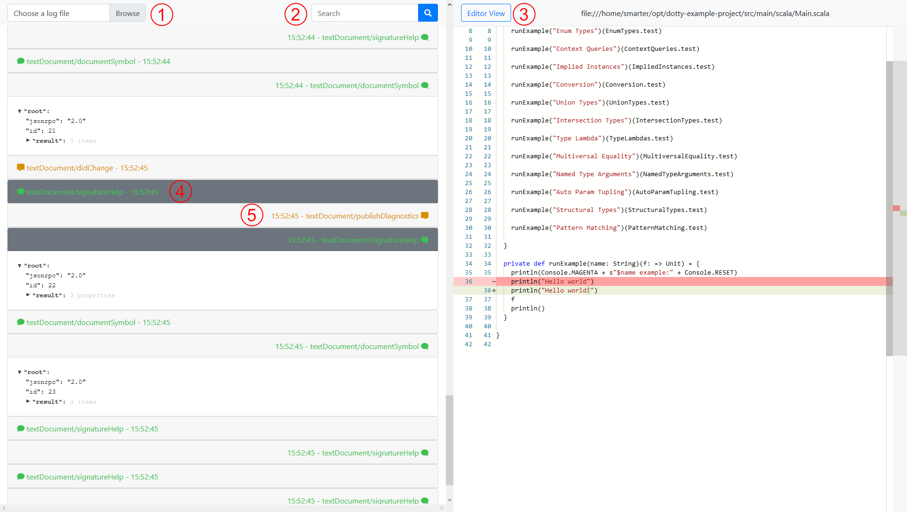

# lsp-viewer

This project aims to provide a simple yet somewhat powerful tool to view logs from the language server protocol. It is heavily inspired by https://github.com/microsoft/language-server-protocol-inspector, with the main added feature being an editor view to show the current state of the code.

## Usage



The viewer comes preloaded with a toy file to play around with. Once the log file is loaded, the LSP messages are displayed as a list on the left pane. Selecting a message can either be done by clicking on its header or by using the keyboard. The left arrow selects the previous message and the right arrow selects the next message chronologically. Selecting a message will expand its content to display an expandable view of the JSON.

1. Loading a log file is done by clicking the "browse" button. The file must contain valid LSP logs.
2. The search field filters the messages containing the search query. Searching is case sensitive and can match any character present in the message. Searching for an empty strings resets the filter.
3. The editor pane shows the state of the code at the time of the selected message. The button toggles between the diff view (as shown on the screenshot) and the classic editor view. The title bar shows the title of the source file being displayed.
4. Request messages are written on the left, non notification messages are written in green. The currently selected message and its corresponding request/response (if applicable) is displayed with a dark grey background. Message headers contain the method of the message and the time at which it was sent/received.
5. Response messages are written on the right. Notifications have a yellow text color.

## Development and Deployment

### Project setup
```
npm install
```

### Compiles and hot-reloads for development
```
npm run serve
```

### Compiles and minifies for production
```
npm run build
```

### Run your tests
```
npm run test
```

### Lints and fixes files
```
npm run lint
```

### Customize configuration
See [Configuration Reference](https://cli.vuejs.org/config/).
